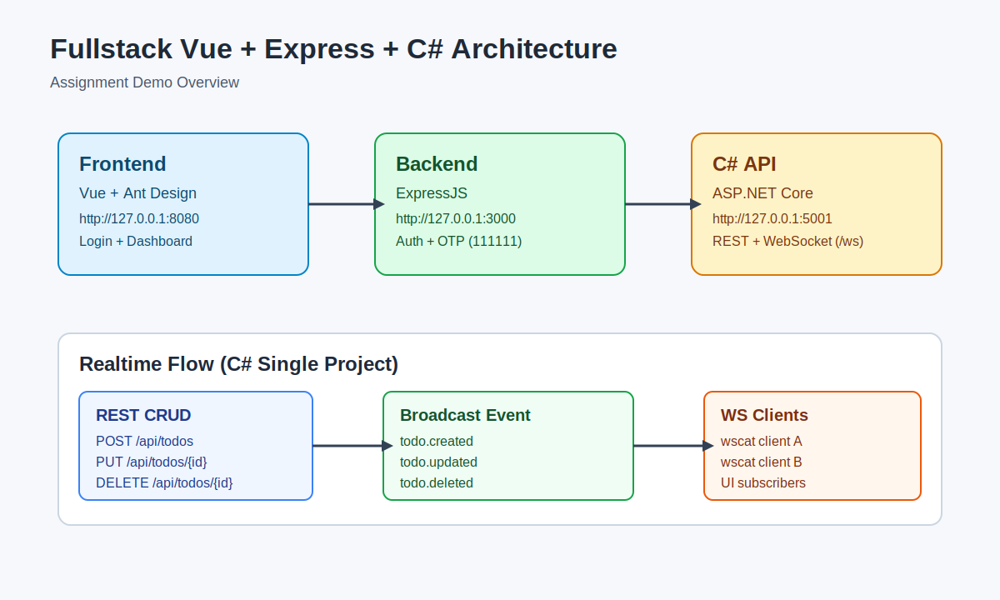
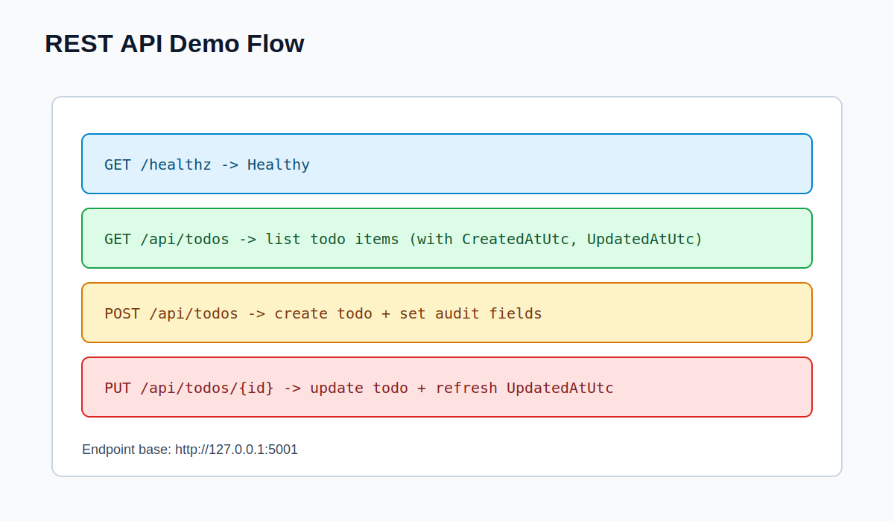
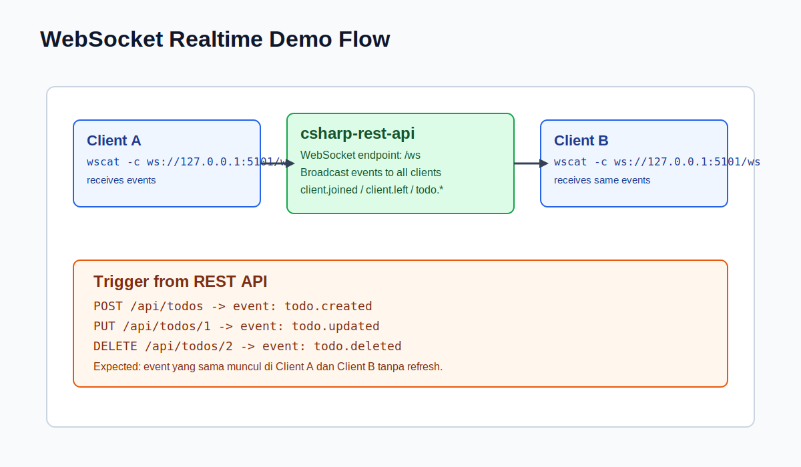

# fullstack-vue-express-csharp

This repository contains the assignment implementation:

- VueJS + ExpressJS (login flow to dashboard)
- C# REST API
- C# WebSocket realtime integration (inside the REST project)

## Project Structure

- `backend/` - Express template backend
- `frontend/` - Vue + Antd template frontend
- `csharp-rest-api/` - ASP.NET Core REST API + WebSocket (`/ws`)
- `docs/` - setup and demo guides

## Quick Start

See the documentation:

- [Setup Guide](docs/setup-guide.md)
- [Demo Guide](docs/demo-guide.md)

## Documentation

- Step-by-step setup: [docs/setup-guide.md](docs/setup-guide.md)
- Step-by-step demo: [docs/demo-guide.md](docs/demo-guide.md)

## Demo Screenshots

### Architecture Overview

### REST API Demo Flow

### WebSocket Demo Flow

## Implemented Highlights

### Vue + Express

- Backend and frontend run locally
- OTP test flow is stable (`111111`)
- Frontend login successfully reaches dashboard
- Sign in error handling is clearer

### C# REST API

- CRUD endpoints at `/api/todos`
- Audit fields: `CreatedAtUtc`, `UpdatedAtUtc`
- Health endpoint `/healthz`
- Swagger enabled in development

### Realtime WebSocket

- Endpoint `ws://<host>/ws`
- Broadcast events for todo create/update/delete
- Connection events: `client.joined` and `client.left`

## Demo Credentials (Vue + Express sample)

- Username: `test`
- Password: `test`
- OTP: `111111`

## Notes

- This repository is prepared for Linux/WSL demo scenarios.
- Demo images are stored in `docs/screenshots/`.
